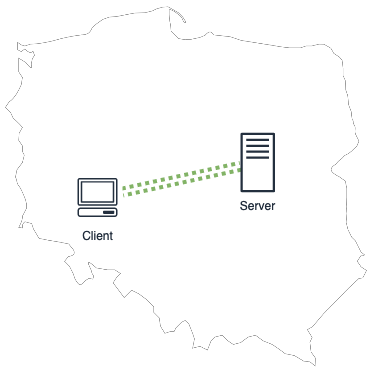
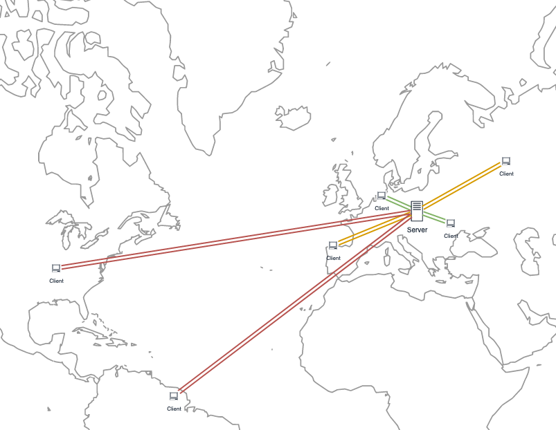
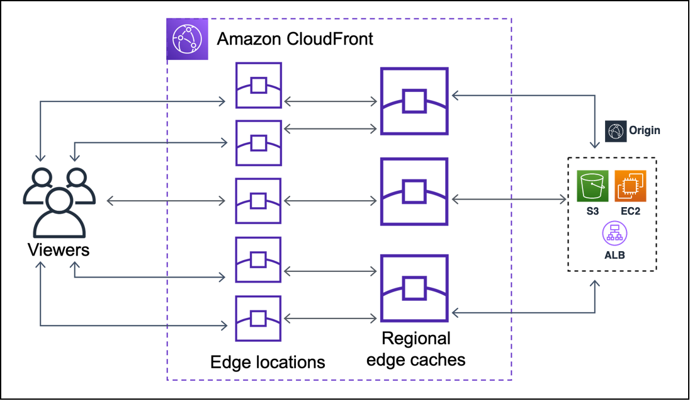
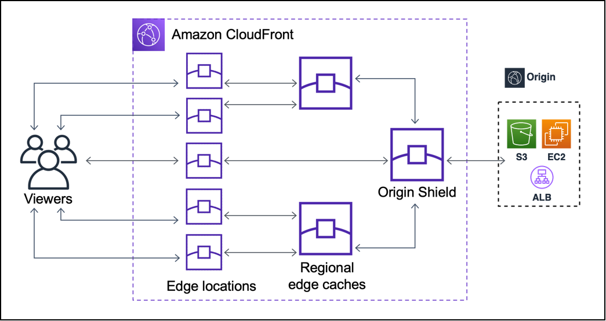
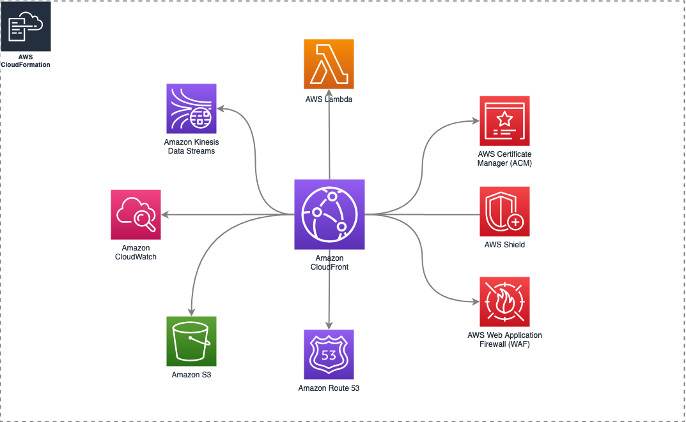

## AWS CloudFront w praktyce

### Agenda

1. [Wprowadzenie do CloudFront](#ad-1-wprowadzenie-do-cloudfront)
1. [Lambda Edge Functions](#ad-2-lambda-edge-functions)
1. [Konfiguracja Dystrybucji CF](#ad-3-konfiguracja-dystrybucji-cf)
1. [Przykładowe use-casy](#ad-4-przyk%C5%82adowe-use-casy)
1. [Demo, serwowanie assetów na przykładzie sitemap](#ad-5-demo-serwowanie-asset%C3%B3w-na-przyk%C5%82adzie-sitemap)
1. [Podsumowanie](#ad-6-podsumowanie)
----

### Ad 1. Wprowadzenie do CloudFront

Czym jest CF wg dokumentacji w wolnym tłumaczeniu

> Amazon CloudFront to rozproszony system dostarczania treści (CDN), który bezpiecznie dostarcza dane, filmy, aplikacje i interfejsy API klientom na całym świecie z niewielkimi opóźnieniami i wysokimi prędkościami transferu, a wszystko to w środowisku przyjaznym dla programistów.

#### Problem z którym CloudFront może nam pomóc

Załóżmy, że mamy stronę internetową zainstalowaną na polskim hostingu, np. może być to datacenter w Warszawie.
Wszyscy są zadowoleni. Strona działa szybko bez opóźnień, hosting nie jest obciążony zapytaniami.

Problem może się pojawić, kiedy strona zyska na popularności. Klienci z sąsiednich krajów czują opóźnienie ale mogą w miarę skutecznie poruszać się po stronie, natomiast w bardziej odległych zakątkach świata na wyświetlenie strony czekamy kilka sekund.

Dlaczego tak się dzieje? Zanim nasze pakiety dotrą do serwera docelowego są one przekazywane przez wiele urządzeń sieciowych i sieci różnych operatorów internetowych. Każde takie przejście wprowadza pewne opóźnienia.

#### CDN/CloudFront rozwiązuje ten problem w taki oto sposób:

Przekierowuje pakiety do najbardziej optymalnego pod względem sieciowym Edge Location(Node/Edge Server), wtedy już ich dalszy transfer leci po sieci szkieletowej Amazonu. Dzięki czemu opóźnienia są minimalne.

*źródło: gtmetrix.com/*

#### Krótko o mechanizmie działania

1. Użytkownik wysyła przez aplikację request HTTP
1. Url requestu jest skonstruowany np. ze ścieżki i query stringa, który stanowi klucz obiektu w pamięci poręcznej/cache
1. CloudFront sprawdza po odebraniu requestu, czy taki obiekt (o takim kluczu) znajduje się w cache **Edge Location**. Jeśli hit to jest zwracany. return;
1. Jeśli obiektu nie ma w Edge Location, wtedy request jest przekazywany do kolejnej warstwy **Regional Edge Cache**. Jeśli hit to jest zwracany. return;
1. Jeśli obiektu nie ma w Regional Edge Cache, wtedy request jest przekazywany do opcjonalnej warstwy **Origin Shield**. Jeśli hit to jest zwracany. return;
1. Finalnie jeśli plik/obiekt nie znajduje się w żadnym z w.w. cache to request trafia do serwera źródłowego. Serwer generuje response, który jest przekazywany przez CloudFront(request HTTP przyp.). Dodatkowo odpowiedź jest zapisywana w cache na *Edge Location*
1. Kolejne podobne requesty z tego Edge Location będą zwracały wyniki z cache.

Różnica między Regional Edge Cache, a Edge Location.
- w Edge Location przechowywane są najczęściej pobierane obiekty
- Z czasem z Edge Location mniej popularne obiekty są z niego usuwane i trafiają do Regional Edge Cache

Jeśli chcemy zwiększyć cache hit ratio/współczynnik trafień to możemy na naszej dystrybucji włączyć opcję **Origin Shield**.
Pełni funkcję opcjonalnej, zcentralizowana warstwa pamięci podręcznej. Znacznie ogranicza wtedy requesty do samego Origina.

#### Integracje CF

- [Amazon Lambda](https://aws.amazon.com/lambda/) umożliwia tzw. przetwarzanie bezserwerowe(serverless computing), uruchamianie kodu aplikacji bez konieczności samodzielnego zarządzania serwerem 
- [Amazon Kinesis Data Streams](https://aws.amazon.com/kinesis/data-streams/) w połączeniu z CF umożliwia przetwarzanie logów w czasie rzeczywistym
- [Amazon CloudWatch](https://aws.amazon.com/cloudwatch/) Monitoring. CF współpracuje z CW, emituje różnego rodzaju metryki.
- [Amazon Route 53](https://aws.amazon.com/route53/) Serwis DNS, umożliwia przypisanie alternatywnych domen do Dystrybucji CF przy użyciu aliasu
- [Amazon Simple Storage Service (S3)](https://aws.amazon.com/s3/) serwis do przechowywania plików, możemy wskazać bucket s3 jako jeden z originów naszej Dystrybucji CF
- [AWS Certificate Manager (ACM)](https://aws.amazon.com/certificate-manager/) umożliwia dodanie certyfikatu SSL do Dystrybucji CF i powiązanie go z nasza domeną.
- [AWS Shield](https://aws.amazon.com/shield/) Ochrona przed DDoS, ochrona warstwy infrastruktury przeciwko atakom modelu OSI 3 i 4 (sieci, transportowa)
- [AWS Web Application Firewall (WAF)](https://aws.amazon.com/waf/) ochrona warstwy aplikacji OSI 6 i 7

----

### Ad 2. Lambda Edge Functions

Lambda@Edge umożliwia przechwytywanie requestów HTTP przechodzących przez CloudFront. Lambdy działają @Edge(w Edge Locations), czyli "blisko użytkownika", co przyspiesza reagowanie i działanie na treści podczas przesyłania.

- Ze względu na ograniczenia, lambdy@edge tworzymy w regionie (N. Virginia) us-east-1.
- Lambdę@Edge przypisujemy do konkretnego Behavioura naszej Dystrybucji CF
- Po zapisaniu zmian konfiguracji, Lambdy@Edge są deployowane na każdy Edge Location (tworzone są repliki)

#### Triggery Lambda@Edge

Naszą lambdę podpinamy pod 1 z 4 triggerów

- Viewer Request – lambda wykonuje się, kiedy CloudFront otrzyma request i zanim sprawdzi, czy obiekt znajduje się Cache
- Origin Request - lambda wykonuje się, kiedy CloudFront forwarduje request do Origina, czyli kiedy requestowany obiekt znajduje się w cache, lambda nie wykonuje się
- Origin Response - lambda wykonuje się, kiedy CloudFront otrzyma response z origina i zanim zapisze obiekt w cache na Edge Location
- Viewer Response - lambda wykonuje się przed zwróceniem response z obiektem i niezależnie, czy obiekt jest w cache, czy nie.

#### Use casy:
todo, jeśli będzie czas

linki:
- https://www.sentiatechblog.com/cloudfront-functions-and-lambda-edge-compared
- https://docs.aws.amazon.com/AmazonCloudFront/latest/DeveloperGuide/lambda-edge-how-it-works.html

----

### Ad 3. Konfiguracja Dystrybucji CF

Dystrybucja - kontener na wszelkie parametry CF, składająca się z:
- Origins - serwery źródłowe z których serwujemy treści
- Behaviours - konfiguracja zachowania się cache'a dla określonej ścieżki HTTP, może to być wildcard
- Error pages - ustawienia obsługi stron błędów
- Restrictions - mechanizm dodatkowych ograniczeń

### Ad 4. Przykładowe use-casy

Kiedy CloudFront może nam się przydać:

- Przyspieszenie dostarczania statycznych zawartości strony (wszelkie assety), np. nie strzelamy po plik do origina (bucket S3) bezpośrednio, a serwujemy zcachowaną wersję pliku z naszego Edge Location
- Szyfrowanie wrażliwych danych formularzy tj. dane osobowe, czy karty płatniczej
- Chcemy serwować prywatne treści, np. korporacyjne dostępne tylko dla ludzi zalogowanych do VPN(np. poprzez ograniczenie IP Lambda @Edge, AWS WAF)
- Wprowadzenie customowych stron np. dla poszczególnych kodów błędów HTTP lub gdy wykonywany jest maintance strony
- serwowanie video, live streaming, np. twitch.tv

linki:
- https://rohan6820.medium.com/aws-case-study-twitch-324ecf8288aa
- https://docs.aws.amazon.com/AmazonCloudFront/latest/DeveloperGuide/IntroductionUseCases.html

----

### Ad 5. Demo, serwowanie assetów na przykładzie sitemap

todo obrazki i komendy

1. Logujemy się do Dashboardu AWS
1. Tworzymy bucket w us-east-1 (N. Virginia)
1. Za pomocą AWS SDK/CLI uploadujemy pliki na stworzony bucket (cały katalog assets)
1. Dodajemy Lambdę Edge, origin-request
1. Tworzymy nową Dystrybucję CF, podpinamy origin s3, dodajemy behaviour pattern
  - podpinamy origin s3
  - dodajemy behaviour pattern
  - pod nasz behaviour podpinamy lambdę Edge
1. Zapisujemy zmiany, czekamy na propagację zmian na Edge Locations

----

### Ad. 6. Podsumowanie

Produkcyjne Dystrybucje CF powinny być wdrażane w postaci Infrastruktury jako kodu, np. szablonu CloudFormation.

#### Wady braku posiadania CDN

- częste zapytania obciążające zasoby obliczeniowe, pamięciowe servera, bazy danych
- spora odległość od klientów, długie czasy oczekiwania
- może doprowadzić do strat wizerunkowych i finansowych związanych z niedotrzymaniem SLA, czyli Service Level Agreement – umowa o gwarantowanym poziomie świadczenia usług.

#### Kiedy warto stosować CDN?

- często odwiedzane strony internetowe
  - o zasięgu ogólnopolskim
  - wielojęzyczne/z zagranicznym ruchem
  - sklepy internetowe
- strony z dużą ilością plików, assetów, zdjęć, filmów, itd.
- strony narażone na ataki 
   - popularne
   - zarabiające serwisy
   - przechowujące cenne dane
- każda inna dowolna strona WWW, która z pewnych powodów ma być szybsza i mieć w 100% profesjonalną architekturę

#### Dlaczego warto użyc CloudFront?

- Szybkość i niezawodność w dostarczaniu treści do klientów (230+ edge locations)
- Bezpieczeństwo
- Głęboka i łatwa integracja z ekosystemem AWS
- Wygodna konfiguracja za pomocą API/SDK/narzędzi Infrastructure as a Code(IaC) np. Terraform, Serverless framework, AWS SAM
- Przetwarzanie żądań i odpowiedzi @Edge za pomocą kodu AWS Lambda Edge Functions, CloudFront Functions
- Metryki i logi dostępne w czasie rzeczywistym (CloudTrail, CloudWatch)

#### Co może być upierdliwe?

- zalegający stary cache, musimy wprowadzić wersjonowanie plików w nazwach, inwalidacja cache często się nie opłaca ze względu na dodatkowe koszty

#### Do poczytania / Linki

- https://www.youtube.com/watch?v=16CShhniGcA
- https://docs.aws.amazon.com/AmazonCloudFront/latest/DeveloperGuide/CloudFrontPricing.html
- https://aws.amazon.com/cloudfront/faqs/

----

